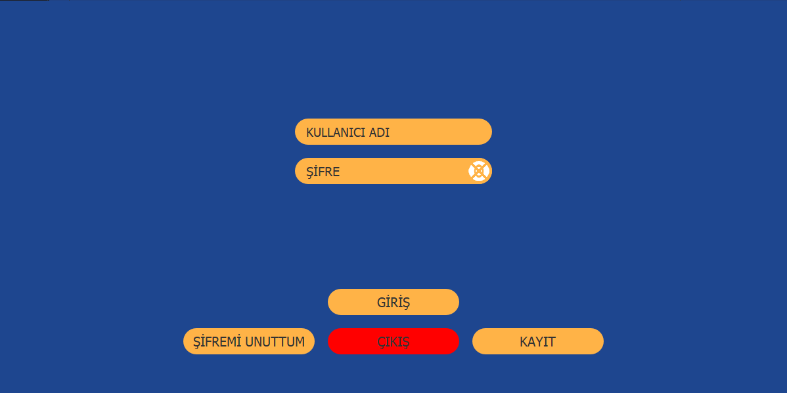
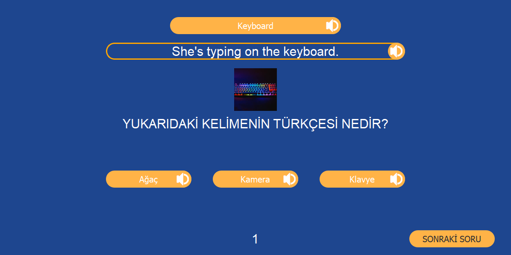
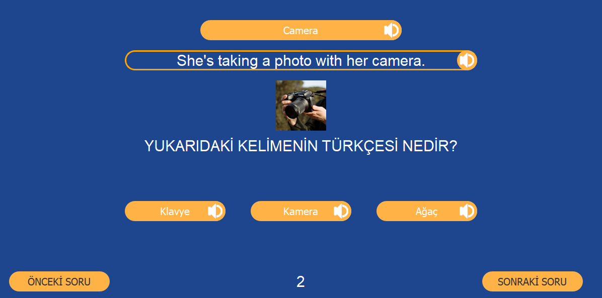
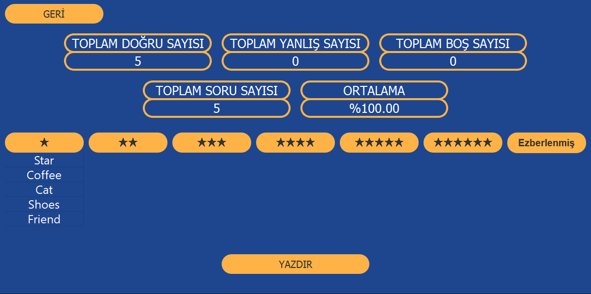
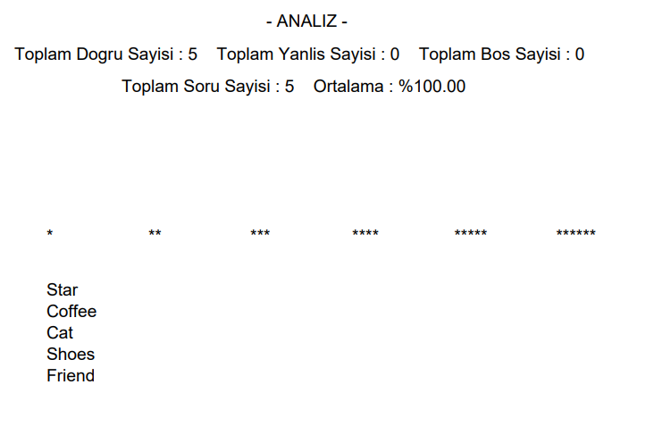

# Kelime Ezberleme Modülü Uygulaması

## Ana İşlevler ve Özellikler

### 1. Giriş ve Kayıt İşlemleri
- Kullanıcılar uygulamaya giriş yapabilir veya yeni bir hesap oluşturabilir.
- Kullanıcı adı ve şifre doğrulaması yapılır.
- Şifresini unutan kullanıcılar için şifre hatırlatma fonksiyonu mevcuttur.

### 2. Sınav Modülü
- Kullanıcılar belirli sayıda kelimeden oluşan sınavlar yapabilirler.
- Sınavlar sırasında rastgele seçilen kelimeler ve bu kelimelere ait seçenekler görüntülenir.
- Sınav tamamlandığında kullanıcıya doğru, yanlış ve boş cevap sayıları gösterilir ve istatistikler güncellenir.

### 3. Seslendirme ve Görsel Destek
- Kelimeler ve cümleler sesli olarak okunabilir.
- Kelimelere ait görseller görüntülenebilir.

### 4. Analiz ve İstatistik
- Kullanıcılar, geçmiş sınavlarına ait istatistikleri ve analizleri görüntüleyebilirler.
- İstatistikler; doğru, yanlış ve boş cevap sayıları ile toplam soru sayısı ve başarı oranını içerir.

### 5. Kelime Seviyeleri ve Ezberleme
- Kullanıcıların bildiği kelimeler seviyelere göre sınıflandırılır.
- Belirli bir seviyeyi geçen kelimeler kalıcı olarak öğrenilmiş kabul edilir ve ayrı bir tabloya taşınır.

### 6. PDF Raporlama
- Kullanıcılar, sınav sonuçlarını ve analizlerini PDF formatında kaydedebilirler.

### 7. Veritabanı İşlemleri
- Kullanıcı bilgileri ve kelime bilgileri SQLite veritabanlarında saklanır.
- Kullanıcıların doğru, yanlış ve boş cevap sayıları gibi istatistiksel veriler kaydedilir.

## Kullanım Amacı
Bu uygulama, dil öğrenen kullanıcıların kelime ezberlemesini kolaylaştırmak ve öğrenme süreçlerini takip etmelerine yardımcı olmak için tasarlanmıştır. Kullanıcılar, kelime bilgilerini sınavlar aracılığıyla test edebilir, öğrenme süreçlerini analiz edebilir ve başarılarını takip edebilirler. Uygulama ayrıca sesli ve görsel destek sunarak kelime ezberleme sürecini daha etkili hale getirir.

